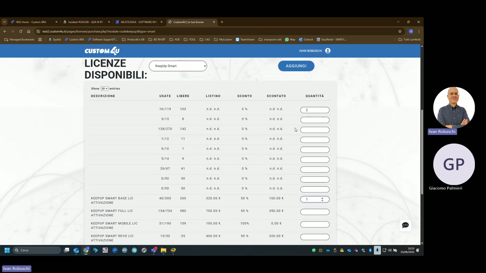

# Gestione licenze

Le licenze KeepUp Smart vengono gestite tramite il portale web **custom4u.it**, accessibile all'indirizzo `test2.custom4u.it`. Il portale consente di visualizzare le licenze disponibili, assegnare attivazioni ai dispositivi e acquistare nuove licenze.

---

## Tipologie di licenza KeepUp Smart

| Tipo licenza | Usate/Totale | Libere | Prezzo listino | Sconto | Prezzo scontato |
|---|---|---|---|---|---|
| **KEEPUP SMART BASE LIC ATTIVAZIONE** | 40 / 300 | 260 | n.d. | 50% | 160,00 € |
| **KEEPUP SMART FULL LIC ATTIVAZIONE** | 154 / 734 | 580 | n.d. | 50% | 350,00 € |
| **KEEPUP SMART MOBILE LIC ATTIVAZIONE** | 31 / 190 | 159 | n.d. | 100% | 0,00 € |
| **KEEPUP SMART REVO LIC ATTIVAZIONE** | 15 / 50 | 35 | n.d. | 50% | 200,00 € |

### Descrizione tipologie

| Tipo | Descrizione |
|---|---|
| **BASE** | Licenza base per funzionalità standard di cassa |
| **FULL** | Licenza completa con tutte le funzionalità avanzate |
| **MOBILE** | Licenza per dispositivo mobile/palmare KeepUp Order (gratuita) |
| **REVO** | Licenza per dispositivi con touchscreen evoluto (REVO) |

---

## Come assegnare una licenza

1. Accedere al portale `test2.custom4u.it` con le credenziali Custom S.p.A.
2. Selezionare **KeepUp Smart** dal menu a tendina
3. Inserire la quantità desiderata nel campo **QUANTITÀ** accanto al tipo di licenza
4. Premere **AGGIUNGI** per procedere all'assegnazione

---

## Attivazione dal dispositivo

Dopo aver assegnato la licenza dal portale, attivare il prodotto sul dispositivo:

1. Aprire KeepUp Smart sul dispositivo
2. Navigare in Impostazioni → **Attivazione prodotto**
3. Inserire il codice di attivazione o procedere con l'attivazione online

!!! note "Nota"
    Le licenze **MOBILE** (per palmare KeepUp Order) sono gratuite. Per ogni palmare cameriere è necessaria una licenza MOBILE separata.

!!! tip "Monitoraggio utilizzo"
    Il portale mostra in tempo reale il numero di licenze usate e disponibili. Prima di installare nuovi dispositivi, verifica di avere licenze libere sufficienti nella tipologia corretta.
