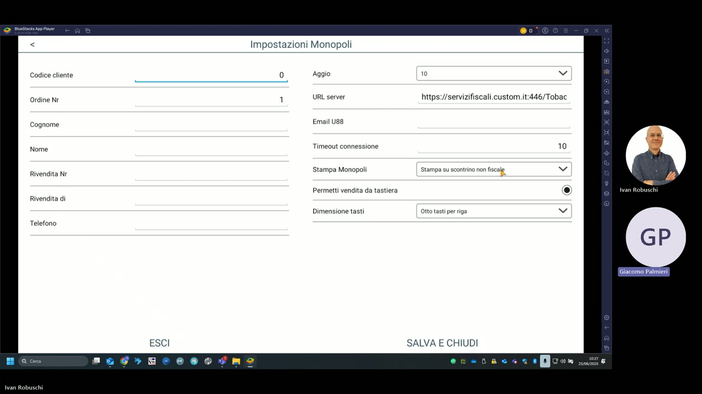
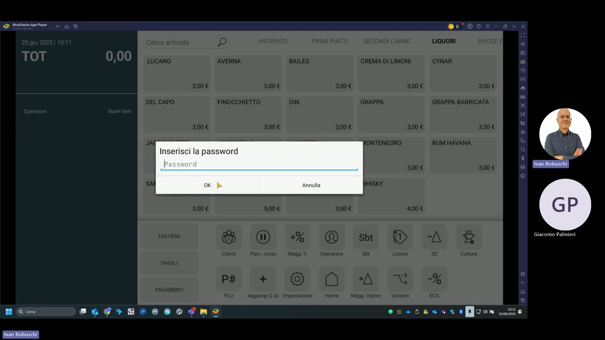

# Gestione Monopoli

Il modulo **Monopoli** di KeepUp Smart consente la vendita di prodotti di monopolio (tabacchi, gratta e vinci, valori bollati) con integrazione al sistema fiscale dei Monopoli di Stato tramite il servizio Custom.

---

## Configurazione — Impostazioni Monopoli

La schermata di configurazione si raggiunge da Impostazioni → Gestione Monopoli (richiede il permesso **Gestione Monopoli** abilitato per l'operatore).

### Dati rivendita

| Campo | Descrizione |
|---|---|
| **Codice cliente** | Codice univoco assegnato da Custom S.p.A. alla rivendita |
| **Ordine Nr** | Numero progressivo ordine (default: 1) |
| **Cognome** | Cognome del titolare della rivendita |
| **Nome** | Nome del titolare |
| **Rivendita Nr** | Numero identificativo della rivendita tabacchi |
| **Rivendita di** | Comune/sede della rivendita |
| **Telefono** | Recapito telefonico |

### Parametri di connessione

| Parametro | Valore demo |
|---|---|
| **URL server** | `https://servizifiscali.custom.it:446/Tobac` |
| **Email U88** | Email per l'invio telematico (modello U88) |
| **Timeout connessione** | 10 secondi |
| **Aggio** | 10% |

### Opzioni di stampa e vendita

| Opzione | Valore demo | Descrizione |
|---|---|---|
| **Stampa Monopoli** | Stampa su scontrino non fiscale | Modalità di stampa del documento monopoli |
| **Permetti vendita da tastiera** | Abilitato | Consente la vendita di prodotti monopolio tramite tastiera senza usare la pagina articoli |
| **Dimensione tasti** | Otto tasti per riga | Layout della pagina articoli monopoli |

---

## Permesso operatore

Per accedere alla funzione Monopoli è necessario che l'operatore abbia il permesso **Gestione Monopoli** abilitato nel proprio profilo. Vedi [Gestione operatori](pos-operatori.md).

---

## Accesso alla funzione dal menu principale

Dalla schermata principale di KeepUp Smart, i prodotti monopolio sono accessibili tramite la categoria dedicata (configurata in Impostazioni → Gestione Monopoli). La vendita richiede l'inserimento della password operatore se il profilo è configurato con restrizioni.

!!! warning "Attenzione"
    La vendita di prodotti monopolio è soggetta a normativa fiscale specifica. Verificare che l'URL del server (`https://servizifiscali.custom.it:446/Tobac`) sia correttamente raggiungibile prima di iniziare la vendita.

!!! note "Scontrino non fiscale"
    Con la configurazione **"Stampa su scontrino non fiscale"**, il documento monopoli viene emesso separatamente dallo scontrino fiscale della cassa, come previsto dalla normativa vigente.
