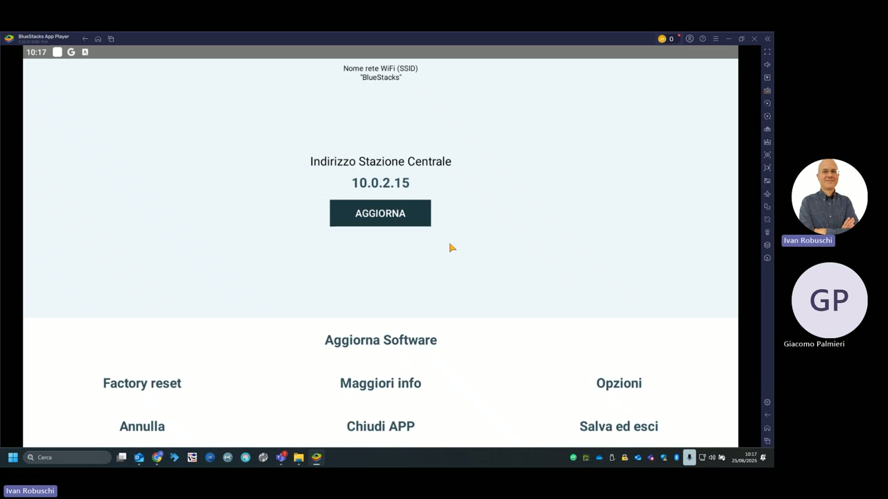
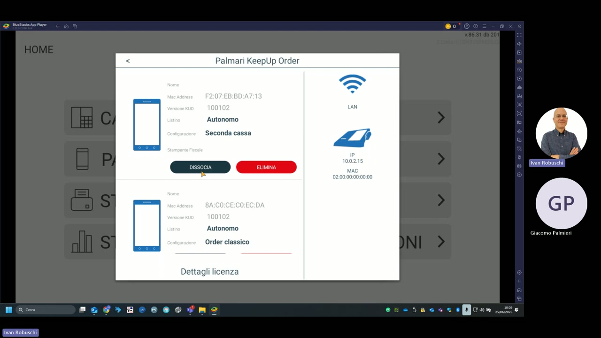
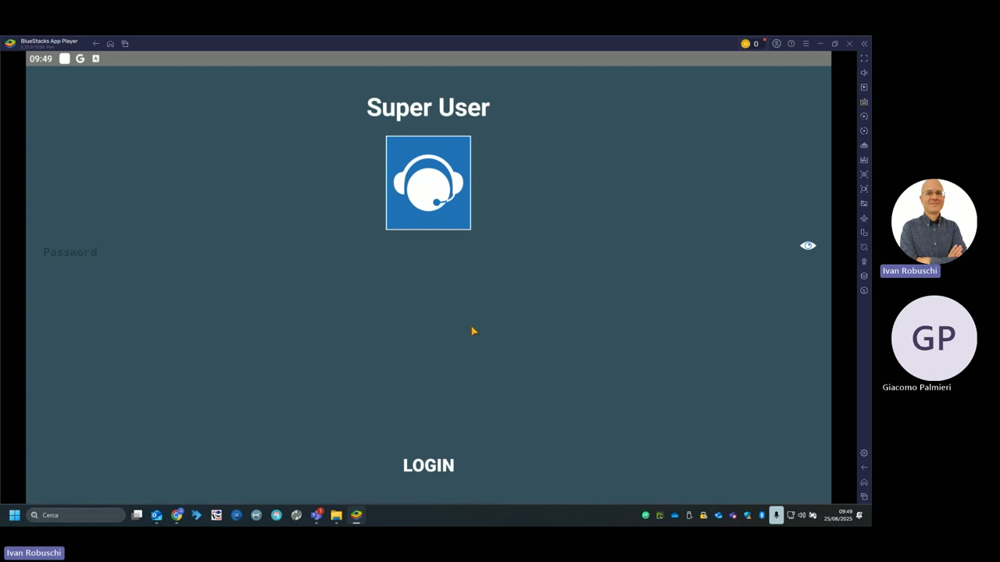

# Configurazione palmari

Questa sezione descrive come configurare e abbinare i palmari KeepUp Order alla stazione centrale KeepUp Smart, impostare l'indirizzo IP e accedere alle opzioni avanzate tramite Super User.

---

## Indirizzo IP stazione centrale

La schermata **Informazioni** (raggiungibile da HOME → Informazioni) mostra e consente di modificare l'indirizzo IP della stazione centrale.

| Campo | Valore demo |
|---|---|
| **Indirizzo Stazione Centrale** | 10.0.2.15 |
| **Nome rete Wi-Fi (SSID)** | BlueStacks |

Il tasto **AGGIORNA** salva il nuovo indirizzo inserito.

### Opzioni aggiuntive

| Opzione | Descrizione |
|---|---|
| **Aggiorna Software** | Controlla e installa aggiornamenti dell'app KeepUp Order |
| **Factory reset** | Ripristina il palmare alle impostazioni di fabbrica (elimina tutti i dati) |
| **Maggiori info** | Mostra informazioni dettagliate sulla versione e i log di sistema |
| **Opzioni** | Accede ad ulteriori opzioni di configurazione |
| **Chiudi APP** | Chiude l'applicazione KeepUp Order |
| **Salva ed esci** | Salva l'indirizzo IP e chiude la schermata |

---

## Palmari abbinati — gestione dalla cassa

Dalla stazione centrale KeepUp Smart è possibile vedere e gestire tutti i palmari abbinati. Per ogni dispositivo vengono mostrati:

| Campo | Palmare 1 | Palmare 2 |
|---|---|---|
| **MAC Address** | F2:07:EB:BD:A7:13 | 8A:C0:CE:C0:EC:DA |
| **Versione KUO** | 100102 | 100102 |
| **Listino** | Autonomo | Autonomo |
| **Configurazione** | Seconda cassa | Order classico |
| **IP** | 10.0.2.15 | — |
| **MAC** | 02:00:00:00:00:00 | — |

### Azioni disponibili per ogni palmare

| Azione | Descrizione |
|---|---|
| **DISSOCIA** | Scollega il palmare dalla stazione (il dispositivo potrà essere riabbinato) |
| **ELIMINA** | Rimuove definitivamente il palmare dall'elenco |
| **Dettagli licenza** | Mostra le informazioni di licenza del dispositivo |

### Configurazioni disponibili

| Configurazione | Descrizione |
|---|---|
| **Order classico** | Modalità palmare standard per presa comanda |
| **Seconda cassa** | Il palmare funziona come seconda cassa autonoma con stampante fiscale |
| **Autonomo** | Il palmare gestisce il proprio listino prezzi indipendentemente |

---

## Accesso Super User

L'accesso **Super User** (raggiungibile da HOME → Super User) richiede una password e consente la configurazione avanzata del palmare, inclusi la gestione degli archivi locali e le impostazioni di rete.

!!! warning "Attenzione — Factory reset"
    Il **Factory reset** elimina tutti i dati locali del palmare (database articoli, configurazione, log). Usarlo solo in caso di problemi gravi e dopo aver sincronizzato i dati con la stazione centrale.

!!! tip "Abbinamento nuovo palmare"
    Per abbinare un nuovo palmare alla stazione centrale, avviare KeepUp Order sul nuovo dispositivo, inserire l'IP della stazione e premere **AGGIORNA**. Il dispositivo appare automaticamente nell'elenco palmari della cassa KeepUp Smart.
