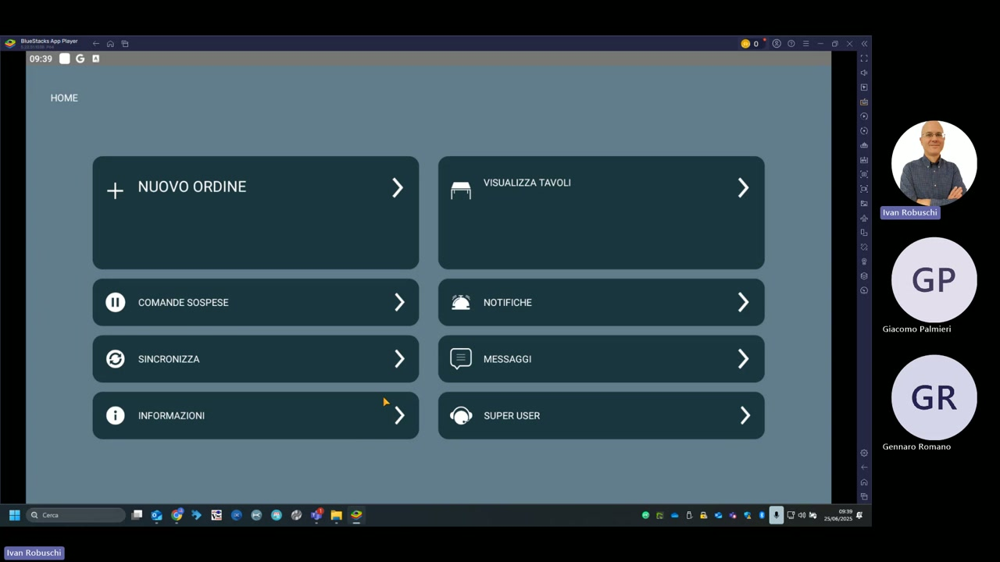

# KeepUp Order — Schermata principale

**KeepUp Order** è l'applicazione Android per il palmare del cameriere. Consente di prendere le comande direttamente al tavolo e sincronizzarle con la stazione centrale KeepUp Smart.



---

## Funzioni disponibili dalla schermata HOME

| Funzione | Descrizione |
|---|---|
| **NUOVO ORDINE** | Avvia una nuova presa comanda: seleziona la sala, il tavolo e inserisci gli articoli |
| **VISUALIZZA TAVOLI** | Mostra la mappa grafica delle sale con lo stato di occupazione dei tavoli |
| **COMANDE SOSPESE** | Elenca le comande create ma non ancora inviate o in attesa di conferma |
| **NOTIFICHE** | Mostra le notifiche ricevute dalla stazione centrale (es. cambio tavolo, messaggio cucina) |
| **SINCRONIZZA** | Scarica il database aggiornato dalla stazione centrale (PLU, sale, tavoli) |
| **MESSAGGI** | Sistema di messaggistica interna tra palmari e cassa centrale |
| **INFORMAZIONI** | Mostra i dati di connessione (IP stazione centrale, versione app) e le opzioni di aggiornamento |
| **SUPER USER** | Accesso protetto da password alle impostazioni avanzate del palmare |

---

## Applicazioni installate sulla piattaforma

KeepUp Smart nel contesto del ristorante utilizza due app Android installate sulla piattaforma BlueStacks (o su dispositivi Android nativi):

| App | Icona | Ruolo |
|---|---|---|
| **KEEPUP Smart** | KC con sfondo rosa | Cassa principale e back-office |
| **KEEPUP Order** | KC con sfondo verde | Palmare cameriere |

!!! tip "Suggerimento"
    Prima di iniziare il servizio, tappa **SINCRONIZZA** per assicurarti che il palmare abbia il menu aggiornato dalla stazione centrale, specialmente dopo aver modificato articoli o prezzi.

!!! note "Video dimostrativo"
    Il video `Demo_kus_Risto_sdg.mp4` (56 min, 128 MB) mostra la demo completa del sistema.

    **Attenzione:** il file supera i 100 MB — limite GitHub per file nel repository. Per includerlo:

    - Usa **Git LFS** (`git lfs track "*.mp4"`)
    - Oppure caricalo su **GitHub Releases** e aggiorna il path `src` nel player sotto

    Una volta caricato (es. su GitHub Releases), embed con path assoluto:

    ```html
    <video controls width="100%">
      <source src="/keepup-smart/assets/resources/Demo_kus_Risto_sdg.mp4" type="video/mp4">
      Il tuo browser non supporta il tag video.
    </video>
    ```
