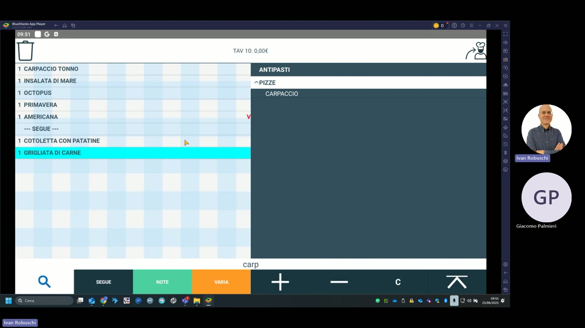

# Inserimento ordini

La schermata di inserimento ordine è il cuore operativo del palmare. Il cameriere seleziona il tavolo, naviga tra le categorie e aggiunge gli articoli alla comanda.

---

## Struttura della schermata

La schermata è divisa in due pannelli:

### Pannello sinistro — comanda in corso

Mostra gli articoli già inseriti per il tavolo selezionato. Per ogni articolo vengono indicati la quantità, il nome e il prezzo. Nell'esempio (TAV 10) la comanda comprende:

| Qt | Articolo | Note |
|---|---|---|
| 1 | CARPACCIO TONNO | — |
| 1 | INSALATA DI MARE | — |
| 1 | OCTOPUS | — |
| 1 | PRIMAVERA | — |
| 1 | AMERICANA | V (variante) |
| — | --- SEGUE --- | separatore di portata |
| 1 | COTOLETTA CON PATATINE | — |
| 1 | GRIGLIATA DI CARNE | (articolo selezionato) |

### Pannello destro — selezione articoli

Mostra le categorie e gli articoli disponibili. La navigazione avviene per categoria → sotto-categoria → articolo. Nell'esempio è visualizzata la categoria **ANTIPASTI** con la sotto-categoria **PIZZE** e l'articolo **CARPACCIO**.

---

## Navigazione tra categorie

La ricerca testuale nella barra inferiore (es. "carp") filtra istantaneamente gli articoli corrispondenti nel pannello di destra.

---

## Tasti di azione

| Tasto | Colore | Funzione |
|---|---|---|
| **SEGUE** | Grigio | Inserisce un separatore "SEGUE" per indicare la portata successiva |
| **NOTE** | Verde | Aggiunge una nota testuale all'articolo selezionato |
| **VARIA** | Arancione | Apre la schermata di selezione varianti per l'articolo |
| **+** | — | Aumenta la quantità dell'articolo selezionato |
| **−** | — | Diminuisce la quantità |
| **C** | — | Cancella l'articolo selezionato dalla comanda |
| **X** (freccia su) | — | Sposta l'articolo selezionato verso l'alto nella lista |
| **Cestino** | — | Elimina l'intera comanda del tavolo |

!!! tip "Separatore di portata SEGUE"
    Usa il tasto **SEGUE** per separare le portate: gli articoli prima del "SEGUE" vengono stampati subito in cucina, quelli dopo vengono trattenuti e inviati alla portata successiva.

!!! note "Nota"
    L'icona dello **chef** in alto a destra indica che la comanda è pronta per essere inviata in produzione. Il tasto in alto a sinistra (cestino) svuota l'intera comanda del tavolo.
