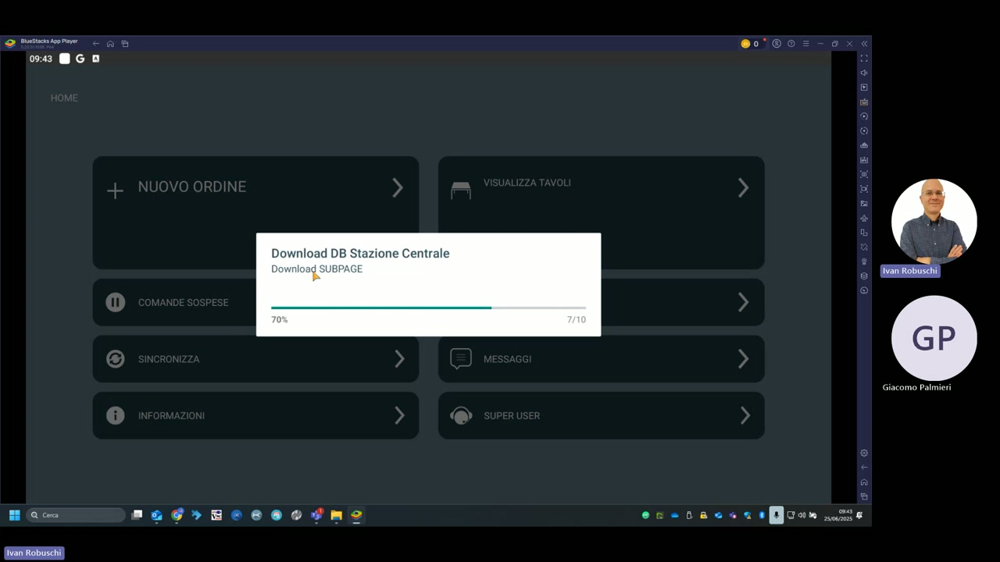

# Sincronizzazione

La funzione **SINCRONIZZA** del palmare KeepUp Order scarica dalla stazione centrale KeepUp Smart il database aggiornato: articoli, prezzi, sale, tavoli e configurazioni.



---

## Processo di sincronizzazione

Alla pressione di **SINCRONIZZA** dalla schermata HOME, il palmare avvia il download del database dalla stazione centrale. La progress bar mostra l'avanzamento:

```
Download DB Stazione Centrale
Download SUBPAGE
70%  [███████░░░]  7/10
```

Il numero indica il numero di sotto-pagine scaricate sul totale (nell'esempio: 7 su 10).

---

## Quando eseguire la sincronizzazione

| Situazione | Azione consigliata |
|---|---|
| Inizio del servizio (pranzo/cena) | Sincronizza sempre prima di iniziare il servizio |
| Dopo modifica del menu in cassa | Sincronizza i palmari per ricevere i nuovi articoli/prezzi |
| Dopo modifica delle sale o tavoli | Sincronizza per aggiornare la mappa tavoli |
| Dopo un aggiornamento software | Sincronizza per allineare i dati tra versioni |
| In caso di articolo non trovato | Sincronizza e ritenta |

---

## Prerequisiti per la sincronizzazione

- Il palmare deve essere connesso alla stessa rete Wi-Fi della stazione centrale
- L'indirizzo IP della stazione centrale deve essere corretto (verificabile in **Informazioni**)
- La stazione centrale (KeepUp Smart) deve essere accesa e operativa

!!! warning "Attenzione"
    Non interrompere la sincronizzazione una volta avviata. Se il download si blocca, attendere il timeout e riprovare. Interrompere a metà download può lasciare il palmare con un database parziale.

!!! tip "Indirizzo IP stazione centrale"
    Nella demo l'indirizzo è **10.0.2.15**. Per verificare o modificare l'indirizzo, vai in HOME → **Informazioni** → campo **Indirizzo Stazione Centrale**.
