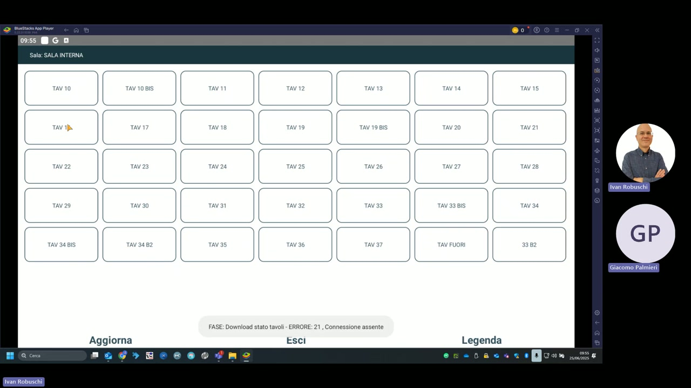
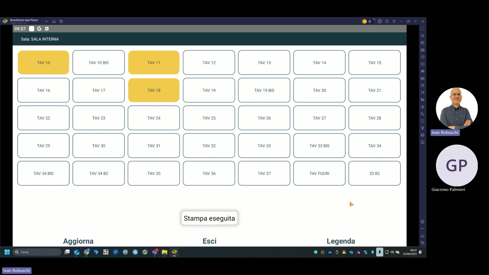
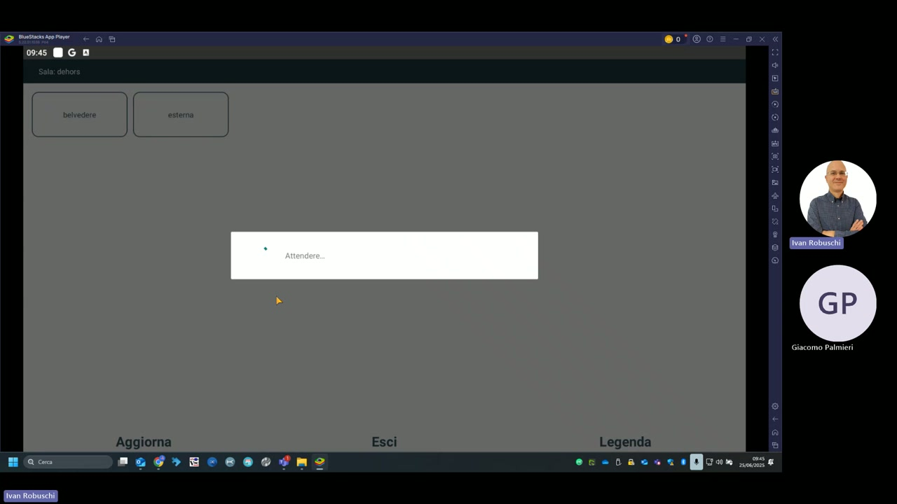

# Gestione tavoli

La sezione **Visualizza tavoli** del palmare KeepUp Order mostra la mappa grafica delle sale con lo stato di occupazione in tempo reale di ciascun tavolo.

---

## Sala interna — vista completa

La sala interna del ristorante nella demo comprende i seguenti tavoli:

| Riga | Tavoli |
|---|---|
| 1 | TAV 10, TAV 10 BIS, TAV 11, TAV 12, TAV 13, TAV 14, TAV 15 |
| 2 | TAV 16, TAV 17, TAV 18, TAV 19, TAV 19 BIS, TAV 20, TAV 21 |
| 3 | TAV 22, TAV 23, TAV 24, TAV 25, TAV 26, TAV 27, TAV 28 |
| 4 | TAV 29, TAV 30, TAV 31, TAV 32, TAV 33, TAV 33 BIS, TAV 34 |
| 5 | TAV 34 BIS, TAV 34 B2, TAV 35, TAV 36, TAV 37, TAV FUORI, 33 B2 |

---

## Sala interna — tavoli occupati

I tavoli con una comanda aperta vengono evidenziati in **giallo/arancione**. Nell'esempio: TAV 10, TAV 11 e TAV 18 risultano occupati. La notifica **"Stampa eseguita"** conferma l'invio della comanda alla cucina.

---

## Sala dehors

La sala **dehors** nella demo comprende due zone:

- **belvedere**
- **esterna**

---

## Legenda colori

| Colore | Stato tavolo |
|---|---|
| Bianco/grigio chiaro | Tavolo libero |
| Giallo/arancione | Tavolo occupato con comanda aperta |

Il tasto **Legenda** in basso a destra mostra la legenda completa dei colori.

---

## Tasti disponibili nella mappa tavoli

| Tasto | Funzione |
|---|---|
| **Aggiorna** | Ricarica lo stato dei tavoli dalla stazione centrale |
| **Esci** | Torna alla schermata HOME |
| **Legenda** | Mostra la legenda dei colori |

!!! warning "Errore di connessione"
    Se compare il messaggio `ERRORE: 21, Connessione assente` nella barra inferiore, il palmare non riesce a raggiungere la stazione centrale. Verificare che il Wi-Fi sia attivo e che l'indirizzo IP della stazione (visibile in **Informazioni**) sia corretto e raggiungibile.
