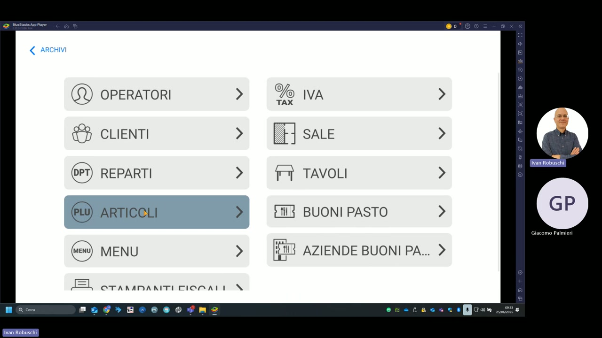

# Archivi

Il menu **Archivi** è il punto di accesso centralizzato a tutte le tabelle di configurazione del sistema. È raggiungibile dalla schermata principale tramite il tasto Impostazioni.

---

## Sezioni disponibili

| Sezione | Descrizione |
|---|---|
| **Operatori** | Gestione degli utenti e dei loro permessi di accesso |
| **IVA** | Configurazione delle aliquote IVA applicabili agli articoli |
| **Clienti** | Anagrafica clienti per fidelizzazione, fatturazione e report per cliente |
| **Sale** | Configurazione sale e assegnazione stampanti per reparto |
| **Reparti** | Definizione dei reparti merceologici (ANTIPASTI, CUCINA, BAR, ecc.) |
| **Tavoli** | Gestione e numerazione dei tavoli per ogni sala |
| **Articoli** | Anagrafica completa PLU: descrizioni, prezzi, reparti, stampanti |
| **Buoni pasto** | Configurazione accettazione buoni pasto |
| **Menu** | Creazione menu fissi con prezzi complessivi |
| **Aziende buoni pasto** | Anagrafica delle aziende emettitrici di buoni pasto convenzionati |
| **Stampanti fiscali** | Configurazione registratori di cassa e stampanti comanda |

---

## Accesso rapido agli archivi principali

Le sezioni di uso più frequente sono:

- [Programmazione articoli](pos-articoli.md) — gestione del menu
- [Programmazione sale](pos-sale.md) — configurazione sale
- [Gestione operatori](pos-operatori.md) — profili utente
- [Stampanti fiscali](pos-stampanti.md) — configurazione RT e stampanti

!!! tip "Navigazione"
    Usa il tasto **&lt;** (freccia indietro) in alto a sinistra per tornare al menu principale senza perdere le modifiche in corso.
