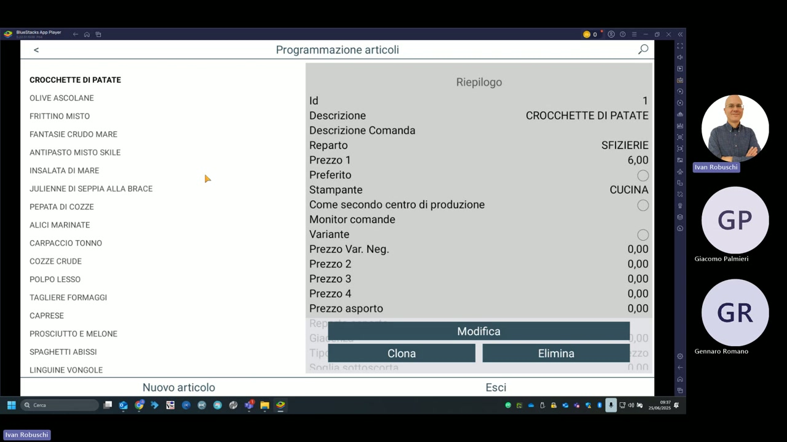

# Programmazione articoli

La sezione **Programmazione articoli** (raggiungibile da Archivi → Articoli) consente di creare, modificare e gestire tutti i PLU del menu ristorante.

---

## Struttura della schermata

La schermata è divisa in due pannelli:

- **Sinistra**: elenco completo degli articoli in ordine di inserimento
- **Destra**: riepilogo e dettaglio dell'articolo selezionato

---

## Campi di un articolo

| Campo | Descrizione | Esempio |
|---|---|---|
| **Id** | Identificativo univoco (PLU) | 1 |
| **Descrizione** | Nome dell'articolo visualizzato in cassa | CROCCHETTE DI PATATE |
| **Descrizione Comanda** | Testo stampato sulla comanda di produzione | — |
| **Reparto** | Reparto di appartenenza (per report) | SFIZIERIE |
| **Prezzo 1** | Prezzo principale di vendita | 6,00 |
| **Prezzo 2/3/4** | Prezzi alternativi (listini) | 0,00 |
| **Prezzo asporto** | Prezzo applicato per asporto | 0,00 |
| **Preferito** | Inserisce l'articolo tra i preferiti (#rapido) | toggle |
| **Stampante** | Stampante di produzione assegnata | CUCINA |
| **Come secondo centro di produzione** | Invia anche a una seconda stampante | toggle |
| **Monitor comande** | Visualizza su monitor di produzione | — |
| **Variante** | Abilita varianti (es. cottura, ingredienti) | toggle |
| **Prezzo Var. Neg.** | Prezzo della variante in detrazione | 0,00 |

---

## Articoli del menu nella demo

La demo mostra il menu completo del ristorante. Di seguito una selezione degli antipasti/stuzzichini caricati:

- Crocchette di Patate
- Olive Ascolane
- Frittino Misto
- Fantasie Crudo Mare
- Antipasto Misto Skile
- Insalata di Mare
- Julienne di Seppia alla Brace
- Pepata di Cozze
- Alici Marinate
- Carpaccio Tonno
- Cozze Crude
- Polpo Lesso
- Tagliere Formaggi
- Caprese
- Prosciutto e Melone
- Spaghetti Abissi
- Linguine Vongole

---

## Azioni disponibili

| Azione | Funzione |
|---|---|
| **Modifica** | Apre l'articolo in modalità modifica |
| **Clona** | Crea una copia dell'articolo selezionato |
| **Elimina** | Elimina definitivamente l'articolo |
| **Nuovo articolo** | Crea un nuovo PLU da zero |
| **Esci** | Torna alla schermata precedente |

!!! warning "Attenzione"
    L'eliminazione di un articolo è definitiva. Prima di eliminare, verifica che il PLU non sia presente in ordini storici o menu attivi.

!!! tip "Clona per velocizzare"
    Usa il tasto **Clona** per creare rapidamente varianti di un articolo esistente (es. stesso piatto con cottura diversa), modificando solo i campi che cambiano.
