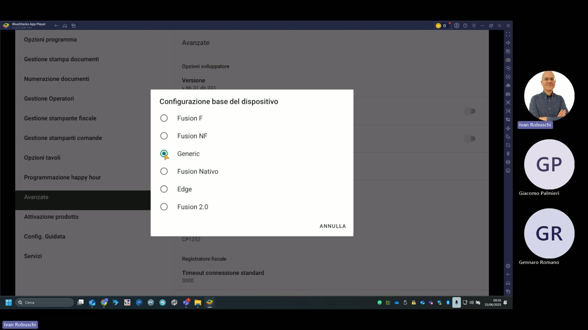
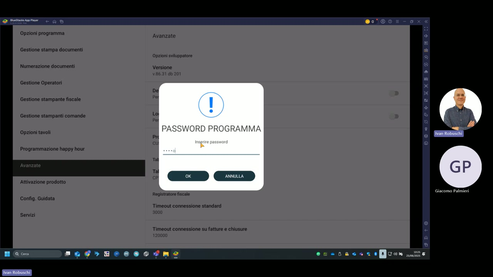

# Impostazioni avanzate

La sezione **Avanzate** (raggiungibile da Impostazioni → Avanzate) raccoglie i parametri di configurazione di basso livello del sistema, tra cui il tipo di dispositivo fiscale, i timeout di connessione e la password di accesso alle impostazioni.



---

## Versione software

La versione del software è visibile nella sezione Avanzate:

```
Versione: v.86.31 db 201
```

---

## Configurazione base del dispositivo

Alla pressione del campo **Tipo** si apre il dialog di selezione del protocollo di comunicazione con la stampante fiscale:

| Opzione | Descrizione |
|---|---|
| **Fusion F** | Protocollo proprietario Custom per registratori di cassa RT |
| **Fusion NF** | Variante non fiscale del protocollo Fusion |
| **Generic** | Protocollo generico — usato nella demo per emulazione |
| **Fusion Nativo** | Comunicazione nativa diretta Custom |
| **Edge** | Protocollo per dispositivi Edge Custom |
| **Fusion 2.0** | Versione aggiornata con supporto funzioni estese |

!!! note "Nota"
    Nella demo il dispositivo è configurato come **Generic**. Per un'installazione con registratore di cassa RT Custom, selezionare **Fusion F**.

---

## Parametri di connessione

| Parametro | Valore demo | Descrizione |
|---|---|---|
| **Codepage** | CP1252 | Codifica caratteri per la stampa fiscale |
| **Registratore fiscale** | — | Tipo di RT collegato |
| **Timeout connessione standard** | 3000 ms | Timeout per operazioni normali (vendita, apertura conto) |
| **Timeout connessione su fatture e chiusure** | 120000 ms | Timeout per operazioni lunghe (fatturazione, chiusura Z) |

---

## Password programma

L'accesso alle impostazioni avanzate è protetto da **PASSWORD PROGRAMMA**. Alla selezione della sezione Avanzate appare il dialog di richiesta password.



!!! warning "Attenzione"
    Conservare la password programma in luogo sicuro. Senza di essa non è possibile accedere alla sezione Avanzate per modificare i parametri di connessione alla stampante fiscale o il tipo di dispositivo.

---

## Opzioni sviluppatore

La sezione **Opzioni sviluppatore** è visibile nella schermata Avanzate ed è riservata al personale tecnico Custom S.p.A. per diagnostica e debug.

---

## Attivazione prodotto

La voce **Attivazione prodotto** consente di inserire o verificare la licenza KeepUp Smart attiva sul dispositivo. Per la gestione centralizzata delle licenze, fare riferimento alla sezione [Gestione licenze](licenze.md).
