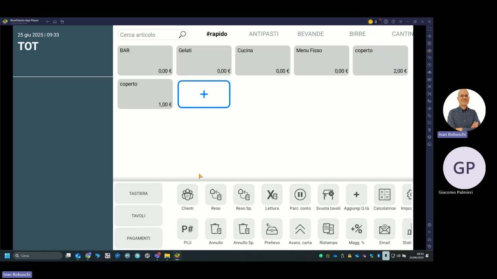
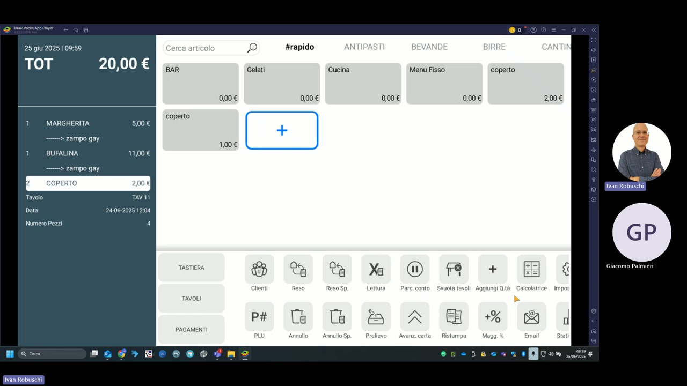

# Interfaccia principale

La schermata di vendita di KeepUp Smart è il punto di lavoro quotidiano del cassiere. Si suddivide in tre aree principali: la barra laterale sinistra con i comandi rapidi, la griglia centrale degli articoli e la barra inferiore delle funzioni.

---

## Barra laterale sinistra

| Tasto | Funzione |
|---|---|
| **TASTIERA** | Accede alla tastiera numerica per la digitazione rapida di quantità o PLU |
| **TAVOLI** | Apre la mappa delle sale e dei tavoli |
| **PAGAMENTI** | Accede alla schermata di chiusura conto e pagamento |

A sinistra viene mostrato il **totale in corso** (TOT) e la data/ora corrente.

---

## Categorie articoli (area centrale superiore)

Le categorie sono visualizzate come tab orizzontali nella parte alta della griglia. Nella demo del ristorante sono configurate:

| Categoria | Contenuto |
|---|---|
| **#rapido** | Articoli preferiti e di uso frequente |
| **ANTIPASTI** | Antipasti della cucina |
| **BEVANDE** | Bevande analcoliche e acqua |
| **BIRRE** | Selezione birre |
| **CANTINE** | Vini e cantina |

### Sotto-categorie configurate in #rapido

| Tasto | Prezzo |
|---|---|
| BAR | 0,00 € |
| Gelati | 0,00 € |
| Cucina | 0,00 € |
| Menu Fisso | 0,00 € |
| coperto | 2,00 € |
| coperto | 1,00 € |
| + (aggiungi) | — |

---

## Barra funzioni (area inferiore)

La barra inferiore contiene due righe di tasti funzione:

### Prima riga

| Funzione | Descrizione |
|---|---|
| **Clienti** | Associa un cliente alla vendita in corso |
| **Reso** | Gestisce un reso articolo |
| **Reso Sp.** | Reso specifico con selezione articolo |
| **Lettura** | Esegue la lettura di giornata (X) |
| **Parc. conto** | Parcheggia il conto su un tavolo |
| **Svuota tavoli** | Svuota rapidamente i tavoli selezionati |
| **Aggiungi Q.tà** | Aggiunge quantità all'articolo selezionato |
| **Calcolatrice** | Apre la calcolatrice integrata |

### Seconda riga

| Funzione | Descrizione |
|---|---|
| **PLU** | Ricerca un articolo tramite codice PLU |
| **Annullo** | Annulla l'ultimo articolo inserito |
| **Annullo Sp.** | Annullo specifico con scelta articolo |
| **Prelievo** | Registra un prelievo di cassa |
| **Avanz. carta** | Avanzamento carta della stampante |
| **Ristampa** | Ristampa l'ultimo documento |
| **Magg. %** | Applica una maggiorazione percentuale |
| **Email** | Invia scontrino dematerializzato via email |

---

## Schermata con conto aperto

Quando è aperto un conto tavolo, la colonna sinistra mostra gli articoli ordinati con quantità e prezzi, il numero del tavolo, la data/ora di apertura e il numero di coperti.

!!! tip "Navigazione rapida"
    Usa il campo **Cerca articolo** in alto a sinistra per trovare rapidamente qualsiasi PLU senza navigare tra le categorie.
