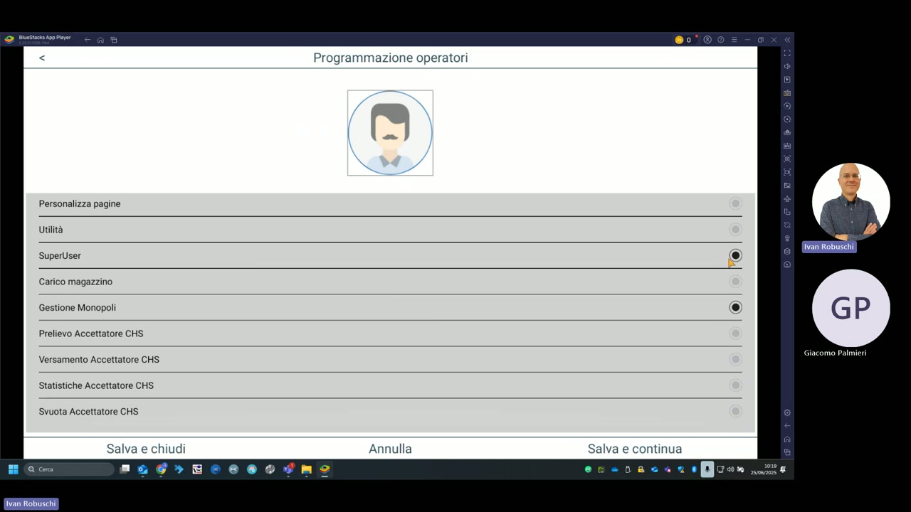

# Gestione operatori

La sezione **Programmazione operatori** (raggiungibile da Archivi → Operatori) permette di creare profili utente con permessi differenziati, garantendo che ogni operatore acceda solo alle funzioni di sua competenza.

---

## Permessi configurabili per operatore

Ogni operatore può avere abilitato o disabilitato ciascuno dei seguenti permessi:

| Permesso | Descrizione |
|---|---|
| **Personalizza pagine** | Consente all'operatore di personalizzare le pagine articoli |
| **Utilità** | Accesso alle funzioni di utilità |
| **SuperUser** | Accesso completo a tutte le funzioni (incluse le impostazioni avanzate) |
| **Carico magazzino** | Gestione del carico merce in magazzino |
| **Gestione Monopoli** | Accesso alla vendita prodotti monopolio (tabacchi) |
| **Prelievo Accettatore CHS** | Prelievo da accettatore di banconote |
| **Versamento Accettatore CHS** | Versamento verso accettatore di banconote |
| **Statistiche Accettatore CHS** | Visualizzazione statistiche accettatore |
| **Svuota Accettatore CHS** | Svuotamento accettatore di banconote |

---

## Tasti di gestione

| Tasto | Funzione |
|---|---|
| **Salva e chiudi** | Salva la configurazione dell'operatore e torna all'elenco |
| **Annulla** | Annulla le modifiche in corso |
| **Salva e continua** | Salva e rimane nella schermata per continuare la configurazione |

!!! warning "Attenzione — SuperUser"
    Il permesso **SuperUser** consente l'accesso a tutte le impostazioni di sistema, incluse quelle avanzate e la programmazione articoli. Assegnarlo solo al personale autorizzato.

!!! tip "Profilo consigliato per cameriere"
    Un operatore cameriere tipico non necessita di accesso a SuperUser, Statistiche o Gestione Monopoli. Limitare i permessi riduce il rischio di modifiche accidentali alla configurazione.
