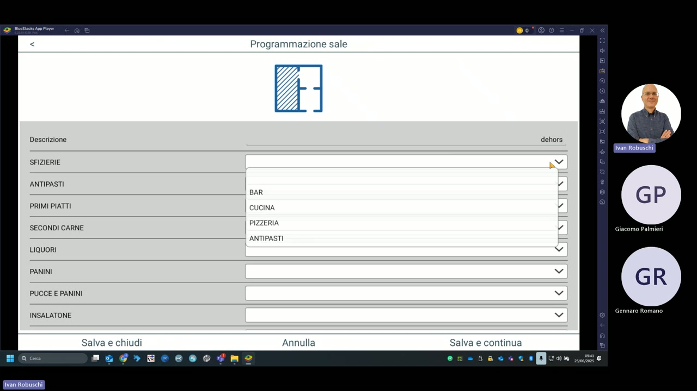

# Programmazione sale

La sezione **Programmazione sale** (raggiungibile da Archivi → Sale) consente di definire le sale del locale e di assegnare a ciascuna i centri di produzione (stampanti) per ogni reparto.

---

## Configurazione della sala

Ogni sala viene configurata con:

- **Descrizione**: nome della sala (es. "dehors", "SALA INTERNA")
- **Assegnazione stampanti per reparto**: per ogni reparto del menu si indica quale stampante di produzione riceve le comande

---

## Reparti e stampanti nella demo

La demo del ristorante mostra la seguente configurazione per la sala **dehors**:

| Reparto | Stampante assegnata |
|---|---|
| SFIZIERIE | BAR, CUCINA, PIZZERIA, ANTIPASTI |
| ANTIPASTI | — |
| PRIMI PIATTI | — |
| SECONDI CARNE | — |
| LIQUORI | — |
| PANINI | — |
| PUCCE E PANINI | — |
| INSALATONE | — |

!!! note "Nota"
    Il menu a tendina per ogni reparto consente di selezionare la stampante di produzione tra quelle configurate in **Gestione stampanti comande**. Le stampanti disponibili nella demo sono: BAR, CUCINA, PIZZERIA, ANTIPASTI.

---

## Tasti di gestione

| Tasto | Funzione |
|---|---|
| **Salva e chiudi** | Salva le modifiche e torna all'elenco sale |
| **Annulla** | Annulla le modifiche in corso |
| **Salva e continua** | Salva e rimane nella schermata per continuare la configurazione |

!!! tip "Suggerimento"
    Se il locale ha più sale (es. interna, terrazza, privé), crea una voce separata per ciascuna in modo da instradare correttamente le comande verso le cucine di competenza.
