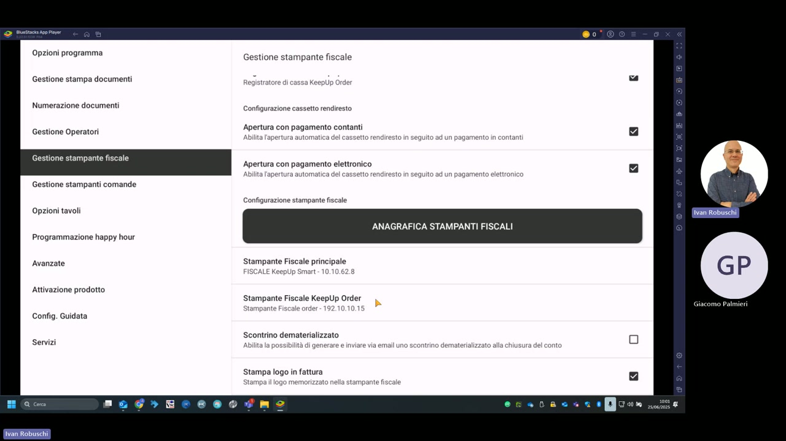

# Gestione stampanti fiscali

La sezione **Gestione stampante fiscale** (raggiungibile da Impostazioni → Gestione stampante fiscale) centralizza la configurazione del registratore di cassa fiscale e del cassetto rendiresto.

---

## Configurazione cassetto rendiresto

| Opzione | Descrizione | Valore demo |
|---|---|---|
| **Apertura con pagamento contanti** | Apre automaticamente il cassetto alla chiusura con pagamento in contanti | Abilitato |
| **Apertura con pagamento elettronico** | Apre automaticamente il cassetto con pagamento elettronico (POS) | Abilitato |

---

## Anagrafica stampanti fiscali

Il pulsante **ANAGRAFICA STAMPANTI FISCALI** apre la gestione dell'elenco dei registratori di cassa collegati al sistema.

### Stampanti configurate nella demo

| Ruolo | Nome | Indirizzo IP |
|---|---|---|
| **Stampante Fiscale principale** | FISCALE KeepUp Smart | 10.10.62.8 |
| **Stampante Fiscale KeepUp Order** | Stampante Fiscale order | 192.10.10.15 |

---

## Opzioni scontrino

| Opzione | Descrizione | Valore demo |
|---|---|---|
| **Registratore di cassa KeepUp Order** | Abilita la stampante fiscale per il palmare KeepUp Order | Abilitato |
| **Scontrino dematerializzato** | Genera e invia lo scontrino via email alla chiusura conto | Disabilitato |
| **Stampa logo in fattura** | Stampa il logo memorizzato nella stampante fiscale | Abilitato |

---

## Protocolli supportati

KeepUp Smart supporta i seguenti protocolli per la comunicazione con la stampante fiscale (configurabile in Impostazioni → Avanzate → Configurazione base dispositivo):

- **Fusion F** — protocollo proprietario Custom per RT fiscale
- **Fusion NF** — variante non fiscale
- **Generic** — protocollo generico (usato nella demo)
- **Fusion Nativo** — comunicazione nativa Custom
- **Edge** — protocollo per dispositivi Edge
- **Fusion 2.0** — versione aggiornata del protocollo Fusion

!!! note "Nota"
    Il **Timeout connessione standard** è impostato a `3000` ms. Per le connessioni su fatture e chiusure il timeout è `120000` ms (2 minuti) per gestire operazioni più lunghe.

!!! warning "Attenzione"
    Prima di modificare l'indirizzo IP della stampante fiscale, verificare che il dispositivo sia raggiungibile sulla rete e che l'IP sia fisso (non DHCP) per evitare disconnessioni dopo i riavvii del router.
