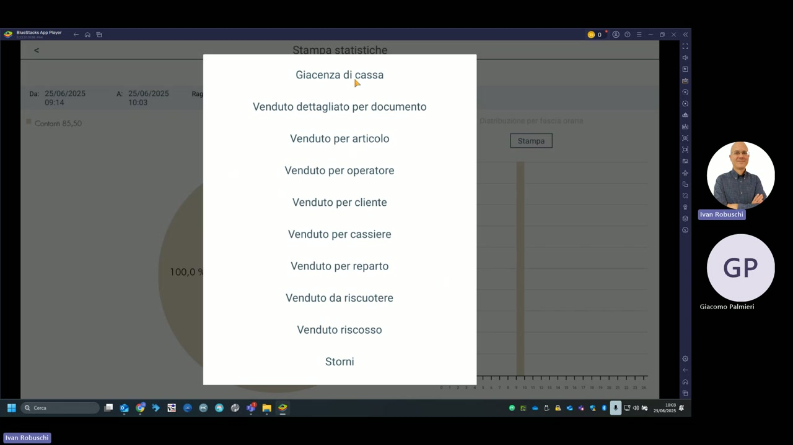

# Statistiche e report

La sezione **Stampa statistiche** di KeepUp Smart fornisce una serie di report gestionali per monitorare le vendite, la giacenza di cassa e l'attività degli operatori.

---

## Report disponibili

| Report | Descrizione |
|---|---|
| **Giacenza di cassa** | Situazione attuale della cassa: contanti presenti, totale venduto, prelievi effettuati |
| **Venduto dettagliato per documento** | Elenco di tutti i documenti (scontrini, fatture) emessi nel periodo selezionato |
| **Venduto per articolo** | Riepilogo delle vendite raggruppato per PLU: quantità e importo per ogni articolo |
| **Venduto per operatore** | Venduto suddiviso per operatore/cassiere, utile per valutare le performance individuali |
| **Venduto per cliente** | Venduto associato ai clienti registrati (se utilizzi la gestione clienti) |
| **Venduto per cassiere** | Simile al per operatore, con focus sul cassiere registrato sulla transazione |
| **Venduto per reparto** | Riepilogo per reparto (ANTIPASTI, CUCINA, BAR, ecc.) per analisi per area |
| **Venduto da riscuotere** | Conti aperti non ancora incassati (tavoli con conto parcheggiato) |
| **Venduto riscosso** | Totale dei conti effettivamente chiusi e incassati nel periodo |
| **Storni** | Elenco delle operazioni di storno/annullo eseguite |

---

## Filtri di periodo

Prima di stampare un report è possibile filtrare per:

- **Data inizio** (Da)
- **Data fine** (A)
- **Operatore/Ragione** (filtro per operatore specifico)

Il sistema visualizza anche un **grafico a torta** della distribuzione per fascia oraria delle vendite.

---

## Modalità di output

| Modalità | Descrizione |
|---|---|
| **Stampa** | Invia il report alla stampante fiscale o di comanda configurata |
| **Email** | Invia il report come allegato all'indirizzo email dell'operatore |

!!! tip "Lettura di giornata (X)"
    Per la lettura di giornata senza azzeramento usa il tasto **Lettura** nella barra funzioni della schermata principale. Per la chiusura con azzeramento Z usa invece la funzione di chiusura fiscale.

!!! note "Nota"
    Il report **Giacenza di cassa** è particolarmente utile durante il turno per verificare la quadratura: mostra i contanti effettivi rispetto al venduto riscosso e ai prelievi registrati.
